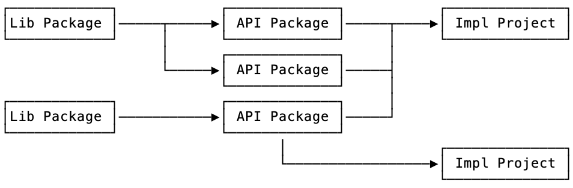

## Dependencies

Dependencies are a mechanism to enable reusability in the protocol buffer
ecosystem. As described in [Package Types](package-types.md), there are three
kinds of package, `lib` (library) and `api` (API), and `impl` (implementation)
-- which is the default used when `buffrs init` is invoked without any extra
parameters. Library and API packages can be used as dependencies. Since library
packages only provide primitive type definitions, they are currently not
allowed to depend on other packages. However, API packages can declare
dependencies on library packages, which allows them to build up messages and
service definitions using those primitives. This allows different service
interfaces to share a cohesive typing foundation while not interfering with
each other as they evolve. Additionally, implementation projects can consume
the other kinds of packages to implement concrete services for a given
language. No packages can declare dependencies on definitions from
implementation projects as those are always final consumers and don't publish a
package that can be depended on. Invoking `buffrs publish` on an implementation
project will produce an error.

The dependencies are declared in the project's manifest file. The declared
dependencies determine which packages get installed when the [`buffrs
install`](../commands/buffrs-install.md) command is invoked. After they have
been installed, dependency packages can be found in the `proto/vendor` path
prefix, as described in [Project Layout](project-layout.md), and can be used
for local code generation (in the case of an implementation project) together
with the local protocol buffer definitions. Note that although API packages can
install dependencies, they typically don't generate code or contain service
logic -- they are only declarative.

### Dependency resolution

The source-of-truth for dependencies are manifest files. The manifest contains
information about where to fetch the dependency from and which version is
required. Published packages carry their project's manifest file so that this
information is made accessible to its consumers. When the install command is
first invoked on a project, Buffrs will build a dependency graph by recursively
downloading and inspecting the manifests from the declared dependencies. This
graph is used for resolving the latest version of a package that satisfies the
requirements of all its dependants. If such a version doesn't exist, the
install command fails.

After the first installation has succeeded, Buffrs will produce a lockfile
(`Proto.lock`) containing information about the resolved versions. This file
will be used to ensure that future invocations of the install command will use
the exact same releases. This ensures that installations are reproducible
across different machines, and that future releases of dependencies won't be
picked up automatically, potentially leading to breaks. Added and removed
dependencies will update the lockfile automatically, so there should be no need
to ever manually edit this file. The lockfile should be kept under version
control together with the manifest file.
